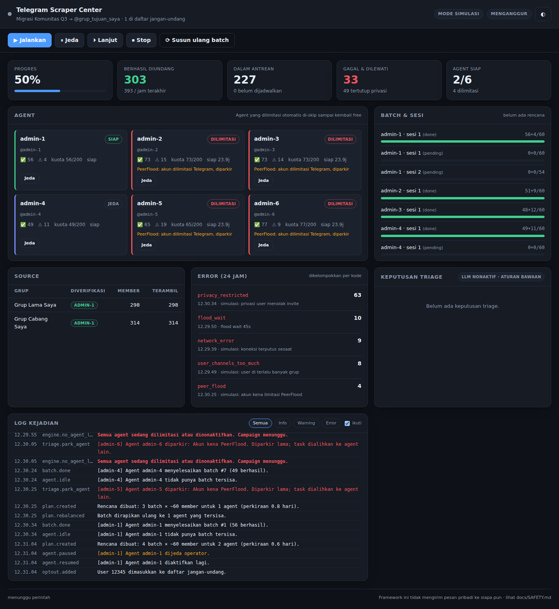

# Telegram Scraper Center

Framework untuk memindahkan member antar grup Telegram yang **Anda kelola
sendiri** — grup lama ke grup baru, atau beberapa grup cabang digabung menjadi
satu — dengan banyak akun admin bekerja paralel, kuota yang dijaga, dashboard
langsung, dan notifikasi bot.

Dijalankan lewat berkas `.bat` di Windows (`bat\`) atau skrip shell di
Linux/macOS (`sh\tsc.sh`).

```
bat\setup.bat            siapkan venv, dependency, config
bat\login-agent.bat      login satu akun agent
bat\doctor.bat           periksa kesiapan lingkungan
bat\validate.bat         cek hak admin — tanpa mengirim invite
bat\start-dashboard.bat  buka dashboard (pintu masuk utama)
bat\run-headless.bat     jalankan tanpa dashboard (VPS / terjadwal)
bat\status.bat           ringkasan kondisi terakhir
bat\plan.bat             susun ulang pembagian batch
bat\test.bat             jalankan test otomatis
```

## Coba dulu tanpa akun Telegram

```bash
python -m tsc dashboard
```

Dengan `telegram.mode` = `"simulate"` (default di `config.example.json`),
seluruh pipeline berjalan memakai grup dan member tiruan — lengkap dengan flood
wait, PeerFlood, dan privasi tertutup. Tidak ada satu pun request ke Telegram.
Hanya butuh Python 3.10+; tanpa `pip install` apa pun.



---

## Yang dikerjakan framework ini

### 1. Antrean source, satu target

`config.json` menerima banyak grup source dan satu grup target. Source diproses
berurutan, member dideduplikasi lintas source, lalu diselang-seling agar antrean
tidak didominasi satu grup.

```json
"campaign": {
  "target": "@grup_tujuan_saya",
  "sources": ["@grup_lama_saya", "@grup_cabang_saya"]
}
```

### 2. Validasi agent — dan validasi source

Lebih dari lima akun agent wajib diisi. Sebelum ada invite yang dikirim,
framework memverifikasi lewat API:

- setiap agent benar-benar **admin di grup target** dan punya hak "Add Users";
- setiap **grup source dikelola sendiri** — minimal satu agent berstatus admin
  di sana.

Agent yang gagal validasi dinonaktifkan; campaign tetap jalan selama sisanya
masih di atas minimum. Agent yang **sedang dilimitasi tetap boleh diinput** —
statusnya diingat, dan agent itu di-skip saat pembagian task sampai kembali
free, lalu otomatis ikut bekerja lagi.

Pemeriksaan source adalah alasan alat ini bukan scraper grup orang lain. Tidak
ada opsi config untuk mematikannya — alasannya di [docs/SAFETY.md](docs/SAFETY.md).

### 3. Batch, sesi, dan paralel

Member yang layak dibagi rata ke semua agent yang bisa dipakai, lalu jatah tiap
agent dipotong menjadi sesi:

```
admin-1  →  sesi 1: 500 member  →  sesi 2: 500 member  →  …
admin-2  →  sesi 1: 500 member  →  sesi 2: 500 member  →  …   (berjalan bersamaan)
```

Ukuran batch dioptimalkan otomatis: kalau `session_size` akan menyisakan ekor
kecil (mis. sesi terakhir cuma 20 member), ukurannya diratakan. Kapasitas tiap
agent dihitung dari sisa kuotanya, jadi agent yang kuotanya sudah terpakai tidak
diberi jatah lebih besar dari yang bisa ia kerjakan.

Tiap agent berjalan sebagai task asyncio sendiri — enam agent berarti enam
invite berjalan berbarengan, masing-masing dengan jeda dan kuotanya sendiri.

### 4. Dashboard

Satu halaman, gelap/terang, tanpa dependency:

- KPI progres, laju per jam, agent siap vs dilimitasi;
- kartu per agent dengan status, kuota terpakai, hitung mundur "siap dalam",
  dan tombol jeda/aktifkan;
- batang progres per batch dan per sesi;
- **error logging** dikelompokkan per kode dengan contoh pesan dan waktu terakhir;
- feed keputusan triage — kenapa suatu agent diparkir atau member dilewati;
- log kejadian realtime dengan filter tingkat keparahan.

Kontrol: jalankan, jeda, lanjut, stop, susun ulang batch, jeda per agent, dan
memasukkan user ke daftar jangan-undang.

### 5. Triage dinamis (LLM)

Setiap kegagalan melewati dua lapis:

1. **Aturan deterministik** — selalu jalan, tanpa jaringan. `FloodWait` ditunggu
   penuh, `PeerFlood` memarkir agent 24 jam, privasi tertutup dilewati tanpa
   retry, gangguan jaringan diulang dengan backoff.
2. **Claude** (`claude-opus-5`) — hanya dipanggil ketika aturan tidak yakin.
   Diberi konteks status agent, progres batch, dan sebaran error satu jam
   terakhir; menjawab dalam skema tertutup: `retry`, `backoff`, `skip_member`,
   `park_agent`, `stop_campaign`, `escalate`.

Kalau LLM tidak tersedia, gagal, atau menjawab di luar skema, keputusan aturan
yang dipakai. Campaign tidak pernah bergantung pada LLM. Konteks yang dikirim
tidak memuat identitas member — hanya kode error dan angka agregat.

> Aksi "kirim pesan" sengaja **tidak ada** dalam himpunan aksi. Framework ini
> tidak mengirim DM ke siapa pun; invite yang gagal karena privasi ditandai
> untuk ditindaklanjuti manusia. Alasannya di [docs/SAFETY.md](docs/SAFETY.md).

### 6. Bot notifikasi

Bot Telegram mengabari: campaign mulai/selesai, batch selesai, agent kena
limitasi, error yang butuh keputusan, dan ringkasan berkala. Ada throttle dan
dedup agar tidak membanjiri chat.

```json
"notifier": { "enabled": true, "chat_id": "-1001234567890" }
```

---

## Kuota: baca ini sebelum menaikkan angka

Default-nya konservatif dan memang seharusnya begitu:

| Setelan | Default | Arti |
|---|---:|---|
| `invites_per_day_per_agent` | 40 | batas harian per akun |
| `invites_per_hour_per_agent` | 15 | batas per jam per akun |
| `min_gap_seconds` + jitter | 45–70 dtk | jeda antar invite |
| `session_size` | 500 | ukuran unit kerja (bukan target harian) |

Enam agent × 40 = 240 invite/hari. Memindahkan 5.000 member butuh sekitar tiga
minggu. Itu bukan hambatan yang perlu dioptimalkan — akun yang dipaksa lebih
cepat akan kena PeerFlood lalu berhenti total, dan framework akan memarkirnya 24
jam. Lebih pelan tapi jalan terus mengalahkan cepat lalu mati.

`session_size` boleh tetap 500 seperti contoh di requirement; itu hanya membuat
progres mudah dibaca. Kuota harianlah yang menentukan laju sesungguhnya.

---

## Struktur

```
tsc/
  config.py        muat & validasi config.json + .env
  store.py         SQLite — state tahan restart
  guard.py         validasi admin target & source
  batching.py      pembagian batch (fungsi murni)
  governor.py      kuota, jeda, flood wait, limitasi per agent
  llm.py           triage: aturan + Claude
  notifier.py      bot Telegram
  orchestrator.py  pipeline, satu task asyncio per agent
  telegram/        adapter: kontrak, Telethon, simulator
  dashboard/       server stdlib + UI satu halaman
tests/             65 test, seluruhnya offline
docs/              ARCHITECTURE.md · OPERASI.md · SAFETY.md
bat/ sh/           peluncur Windows & Unix
```

## Test

```bash
python -m pytest tests -q     # 65 passed in ~2s
```

Seluruh test memakai klien simulasi dan waktu virtual: flood wait 120 detik
diperlakukan sebagai 120 detik oleh governor tanpa menunggu sungguhan.

## Kebutuhan

- Python 3.10+ — cukup itu untuk mode simulasi dan dashboard.
- `telethon` — mode live.
- `anthropic` — triage LLM (opsional).

## Baca juga

- [docs/OPERASI.md](docs/OPERASI.md) — panduan harian, gejala & tindakan
- [docs/ARCHITECTURE.md](docs/ARCHITECTURE.md) — desain internal
- [docs/SAFETY.md](docs/SAFETY.md) — batasan dan alasannya
